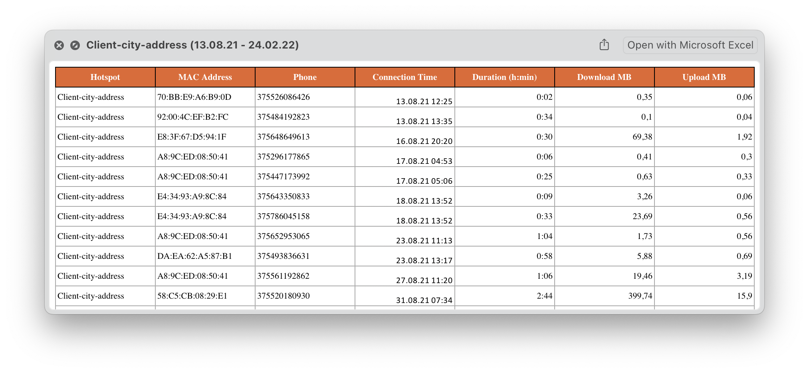

# Freewifi.by-Telegram-Bot 

https://t.me/FreewifibyBot

---

A Bot through which the Clients of [Freewifi.by](freewifi.by) 
get the wi-fi connection statistics from their hotspots.

The data is fetched from two remote databases:
- `radius.radacct` (FreeRADIUS server)
- `wifi_wp_base.wp_proxy_entries` (WordPress SMS-auth plugin)

Then it gets processed, saved to the [local Cache](Modules/ConnectionHistory.py) 
for a quicker subsequent access, and sent to a user in a 
 formatted .xlsx file.

## Features

---
- [x] Passwordless authentication via deep linking, fail2ban
- [x] [Logging](Modules/Bot.py) of all the incoming and outgoing messages
- [x] [Sqlite ORM](Modules/BotDatabase.py) (Yes, I am aware of sqlalchemy, just wanted to practice:)

## ToDo

---
- [ ] Line charts for the unique hotspot users over the given period

## Credits

---
Special thanks for the awesome libraries:
- eternnoir [pyTelegramBotAPI](https://github.com/eternnoir/pyTelegramBotAPI)
- jmcnamara [XlsxWriter](https://github.com/jmcnamara/XlsxWriter)

Full list in requirements.txt
